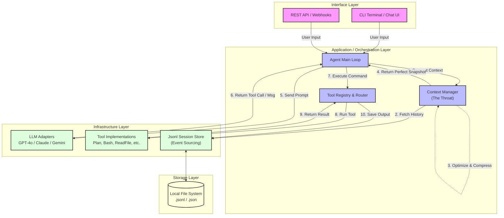
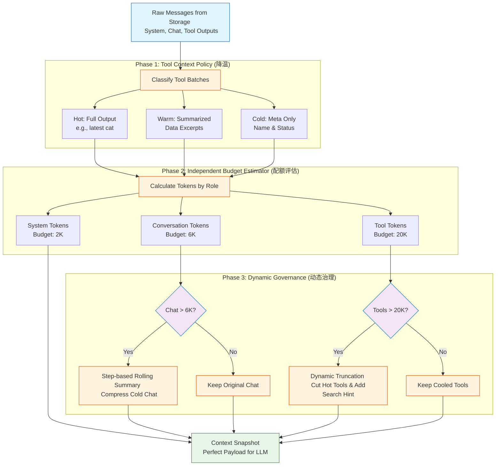
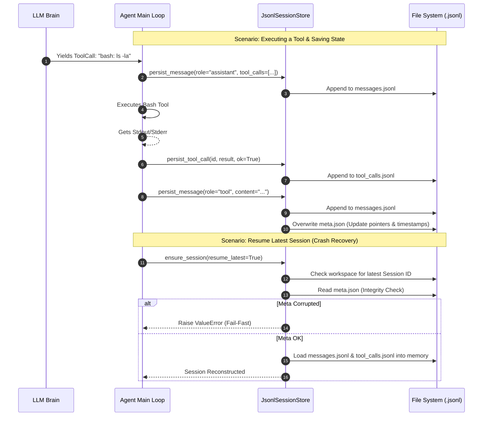
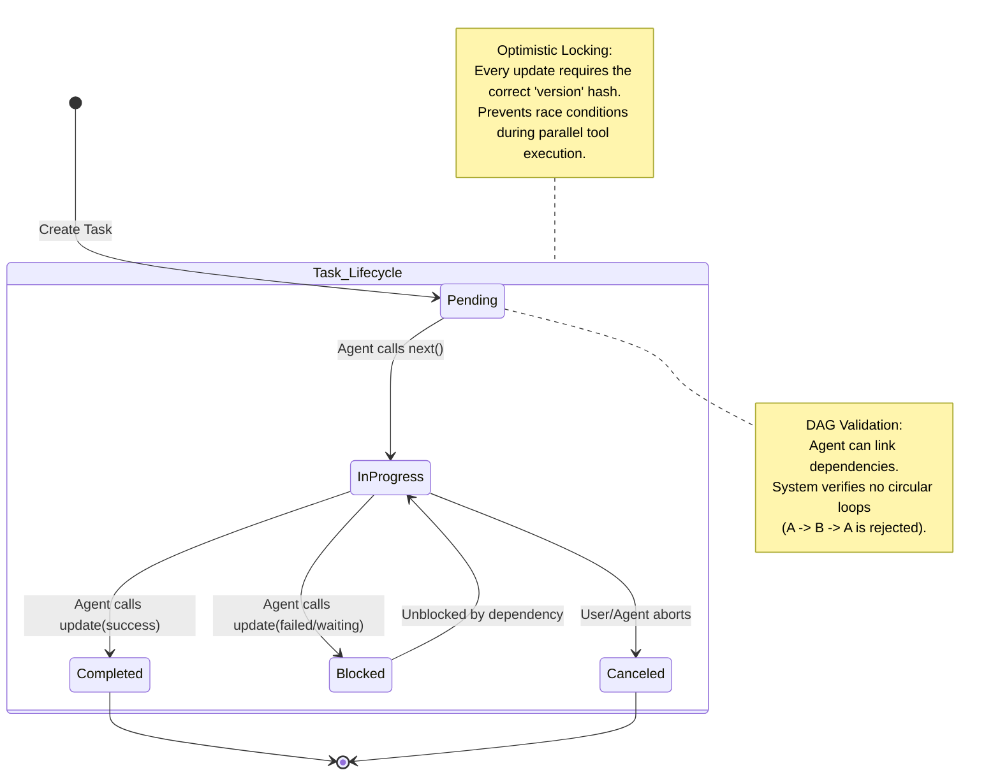

# Agent System Architecture & Mechanisms

This document contains Mermaid diagrams and explanations designed for product presentations, technical deep-dives, and architectural reviews. You can render these diagrams directly in markdown viewers (like GitHub, Notion, or Obsidian) or paste the code into [Mermaid Live Editor](https://mermaid.live).

---

## 1. Overall Agent Architecture

**Purpose:** To show the high-level, decoupled, layered design of the Agent. It highlights the `ContextManager` as the crucial "throat" of the system that connects the LLM Brain with the Tools and Memory.

**Presentation Script / 旁白解说：**
> “这是我们 Agent 的全局架构图。整个系统采用了严格的分层设计。最上面是交互层，支持 CLI 和未来的 API。最核心的是中间的编排层，这里的重点是 **ContextManager（上下文管理器）**。它就像系统的咽喉，每次向大模型发送请求前，都会通过它去底层拉取历史记录，并进行智能压缩和清洗。底层的基础设施层包含了大模型适配器、工具箱以及基于 Event Sourcing 的持久化引擎。这种高内聚低耦合的设计，保证了我们能随时更换大模型，或者低成本接入新的工具。”

---

## 2. Context Management Pipeline (长上下文动态无感管理机制)

**Purpose:** To showcase the advanced "Independent Priority-based Budgeting", "Tool Temperature Degradation", and "Step-based Compaction" mechanisms. This proves the system will never crash due to `context_length_exceeded` and saves massive API costs.

**Presentation Script / 旁白解说：**
> “这是我们最引以为傲的核心护城河：长上下文无感压缩管线。普通的 Agent 会把所有东西塞进一个池子里，一旦超限就直接崩溃或强行清理。我们采用了**‘三分独立配额’**机制。首先，我们会对历史的工具输出进行**‘物理降温’**，越老的工具输出留存的内容越少。接着，系统会独立计算纯对话（6K额度）和工具输出（20K额度）的用量。如果纯对话超限，触发无感滚动摘要；如果工具输出超限，触发动态截断，并给大模型贴心地加上‘请使用搜索工具’的提示。它们互不干扰，确保大模型永远处于最佳的‘工程甜点（Sweet Spot）’状态。”

---

## 3. Event Sourcing & Session Persistence (事件溯源与会话持久化)

**Purpose:** To explain how the agent stores memory. Instead of a fragile single JSON file, it uses append-only logs (Event Sourcing) to guarantee zero data loss, enabling flawless crash recovery and historical debugging.

**Presentation Script / 旁白解说：**
> “我们如何保证 Agent 跑了几个小时的任务不会因为意外断电而白费？这得益于我们的 Event Sourcing（事件溯源）持久化机制。如时序图所示，我们不使用单一的大文件覆盖写入，而是将用户的对话、助手的动作、工具的执行结果，分别以 `Append-only`（只追加）的形式写入 `.jsonl` 流式日志中。同时维护一个轻量级的 `meta.json` 作为索引快照。当系统重启并执行 `--resume` 时，我们会严格校验快照合法性，然后像播放录像带一样，把所有日志重放回内存，瞬间恢复断电前的完美现场。”

---

## 4. Complex Task DAG Planning (复杂任务有向无环图规划)

**Purpose:** To illustrate the cognitive process of the Agent when tackling massive projects. It uses the `Plan` tool to break down tasks, establish dependencies, and maintain state via optimistic locking.

**Presentation Script / 旁白解说：**
> “最后，我们来看看 Agent 是如何处理需要几十步才能完成的复杂软件工程的。普通的 Agent 走一步看一步，容易陷入死循环。而我们的 Agent 拥有原生的 `Plan` 规划能力。在开始写代码前，它会拆解出包含依赖关系的 DAG（有向无环图）任务树。图上展示了任务的状态流转，只有当前置任务（比如配置数据库） `Completed` 后，后续任务（比如写接口）才会从 `Blocked` 变为 `Pending` 进而被执行。更牛的是，底层采用了乐观锁（版本号校验）机制，确保哪怕未来 Agent 开启了多线程并发干活，任务状态也绝对不会发生错乱。”