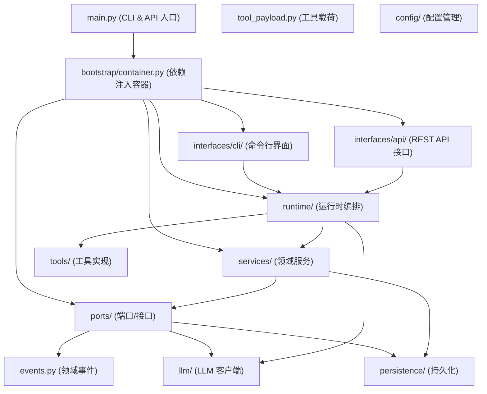
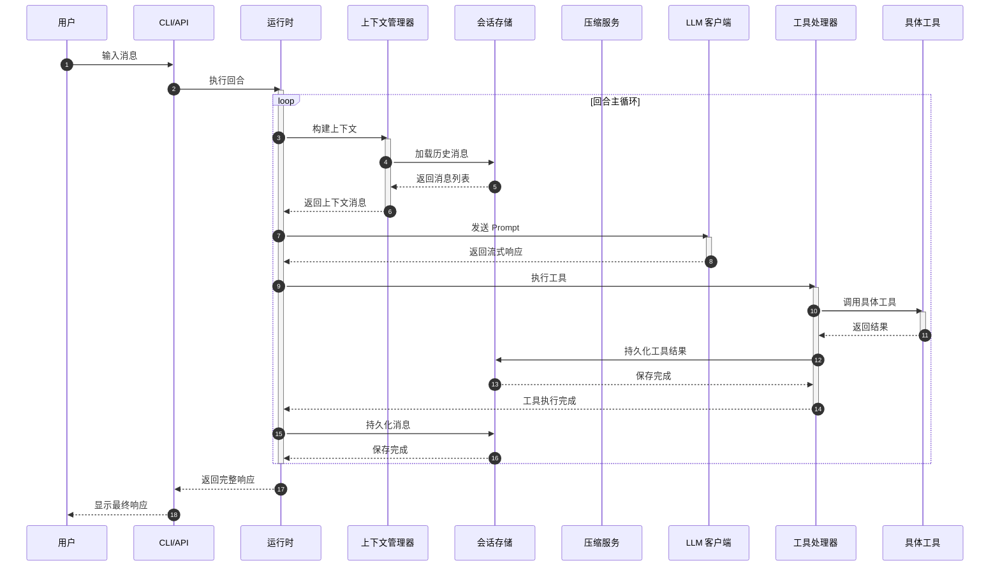
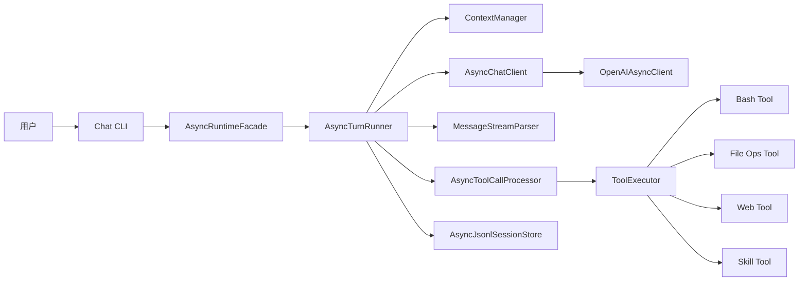
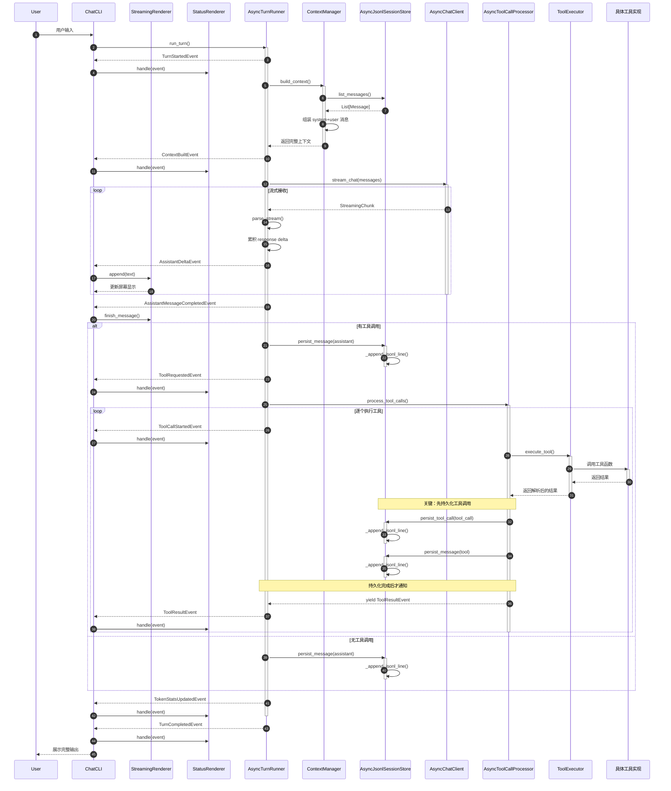

# Agent 整体架构

## 系统层级架构图



## 数据流架构图 (会话流程)



## 核心组件交互图



## 超详细数据流图 (代码级)



## 目录结构说明

### 整体架构分层
```
├── agent/
│   ├── interfaces/        # 接口层：CLI 和 API 入口
│   ├── application/       # 应用层：业务逻辑和编排
│   ├── domain/            # 领域层：核心模型和事件
│   ├── infrastructure/    # 基础设施层：外部依赖实现
│   ├── bootstrap/         # 引导层：依赖注入容器
│   └── prompts.py         # 系统提示词
├── main.py                # 程序入口
```

### 各层详细职责

1. **接口层 (Interfaces)**
   - CLI：命令行交互、流式渲染、富文本 UI
   - API：RESTful 服务端点

2. **应用层 (Application)**
   - Runtime：回合调度、工具处理流程
   - Services：压缩、上下文管理、Token 用量
   - Ports：接口契约抽象

3. **领域层 (Domain)**
   - 事件定义、工具载荷、压缩边界模型

4. **基础设施层 (Infrastructure)**
   - LLM 客户端、JSONL 持久化、工具实现、技能仓库、规划系统
