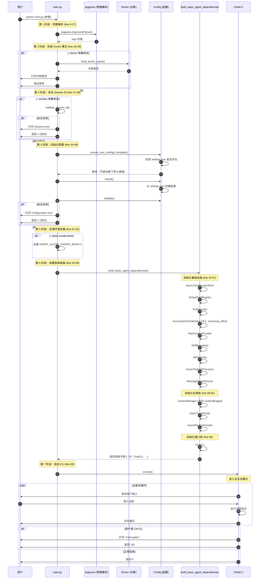

# Main.py 完整数据流图

## 完整启动流程 Mermaid 图



## 各阶段详细说明

### 1. 参数解析（Line 9-17）
解析所有命令行参数：
- `--version` - 显示版本号
- `--debug` - 调试模式
- `--allow-unsafe-bash` - 允许危险的 shell 命令
- `--session` - 指定 Session ID
- `-c, --resume-latest` - 恢复最近的会话
- `--session-dir` - 会话存储目录
- `--doctor` - 运行诊断

### 2. Doctor 模式（Line 19-29）
如果使用 `--doctor`：
- 构建诊断报告
- 打印报告
- 退出程序

### 3. Session ID 验证（Line 31-38）
验证 Session ID 格式是否合法

### 4. 配置初始化（Line 44-49）
```python
Config.ensure_user_settings_template()  # 确保 settings.json 存在
Config.reload()                          # 重新加载配置
Config.validate()                        # 验证配置
```

### 5. 环境变量设置（Line 51-52）
如果使用 `--allow-unsafe-bash`，设置 `AGENT_ALLOW_UNSAFE_BASH=1`

### 6. 依赖容器构建（Line 54-59）
调用 `build_basic_agent_dependencies()`，按以下顺序初始化：

1. **基础设施层**：
   - AsyncJsonlSessionStore（会话持久化）
   - DefaultToolRegistry（工具注册表）
   - ToolExecutor（工具执行器）
   - AsyncOpenAIChatClient（LLM 客户端）
   - PlanContextProvider（计划上下文）
   - SkillRepository（技能仓库）
   - SkillSelector（技能选择器）
   - AsyncToolCallProcessor（工具处理器）
   - MessageStreamParser（消息流解析器）

2. **应用层**：
   - ContextManager（上下文管理器）
   - AsyncTurnRunner（回合执行器）
   - AsyncRuntimeFacade（外观层）

3. **接口层**：
   - ChatCLI（命令行界面）

### 7. CLI 启动（Line 60）
调用 `cli.start()`，进入交互式聊天模式

## 异常处理

### KeyboardInterrupt（Ctrl+C）
```python
except KeyboardInterrupt:
    print("\nInterrupted.", file=sys.stderr)
    return 130
```
- 捕获中断
- 打印退出信息
- 返回状态码 130（标准中断码）

### 配置错误
```python
except ValueError as exc:
    print(f"Configuration error: {exc}", file=sys.stderr)
    return 1
```
- 捕获配置异常
- 打印错误信息
- 返回状态码 1

## 退出码

| 状态码 | 含义 |
|--------|------|
| 0 | 成功 |
| 1 | 配置错误 / Session 错误 / 诊断失败 |
| 130 | 用户中断（Ctrl+C） |
